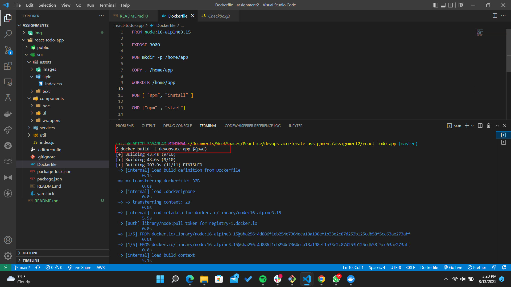
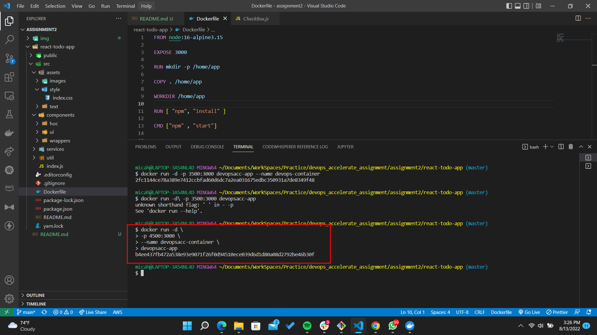

- ### Write a short Dockerfile that builds an image from an application package located in your Present Working Directory – (pwd)

- ### Write a docker command that launches an application container from same image

- <u>Find `Dockerfile` inside the [todo-app/src/](./todo-app/src/Dockerfile) directory</u>

- Got this code from a random github repository- https://github.com/kabirbaidhya/react-todo-app

