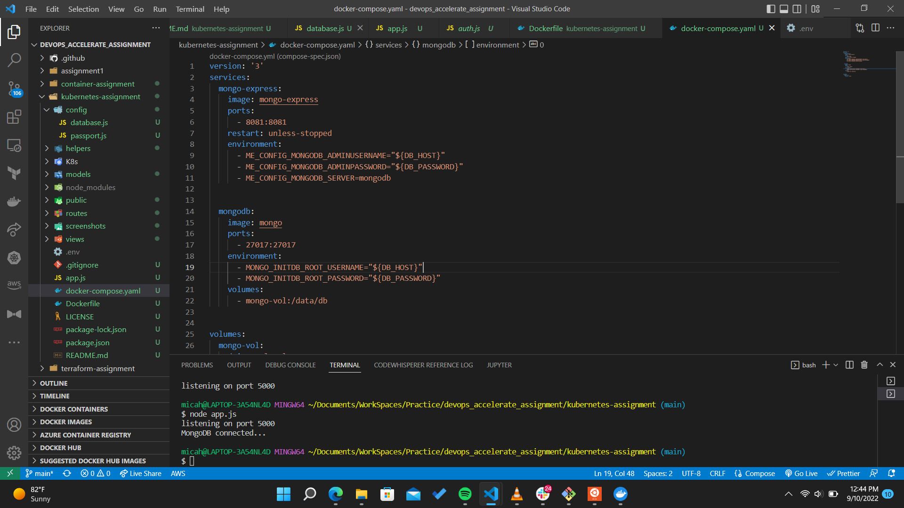
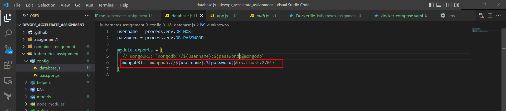
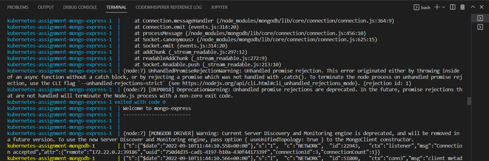
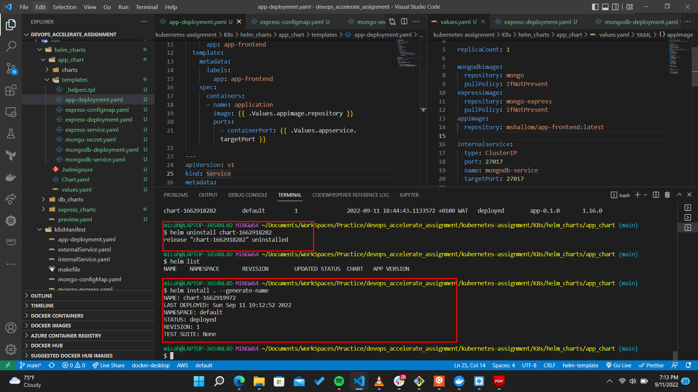
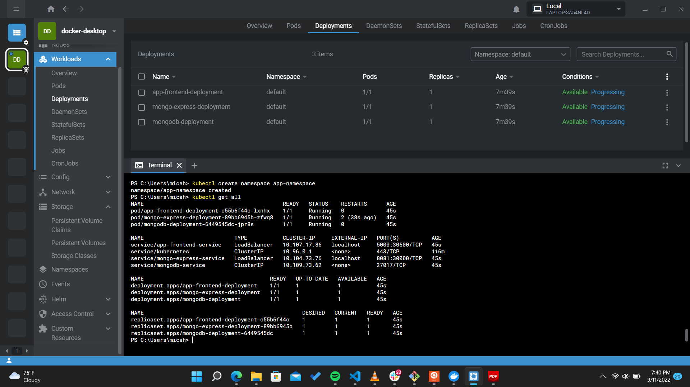
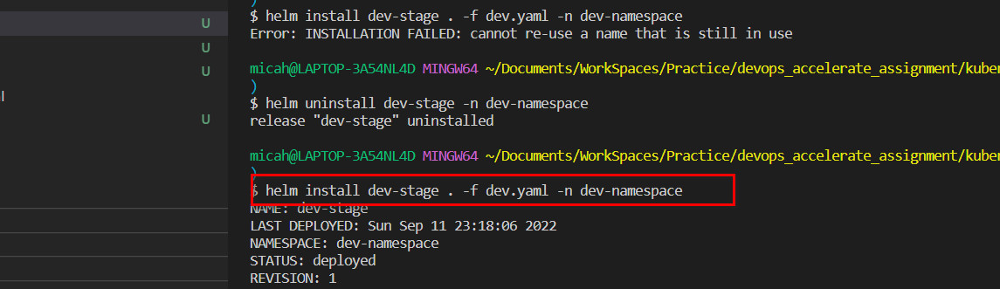
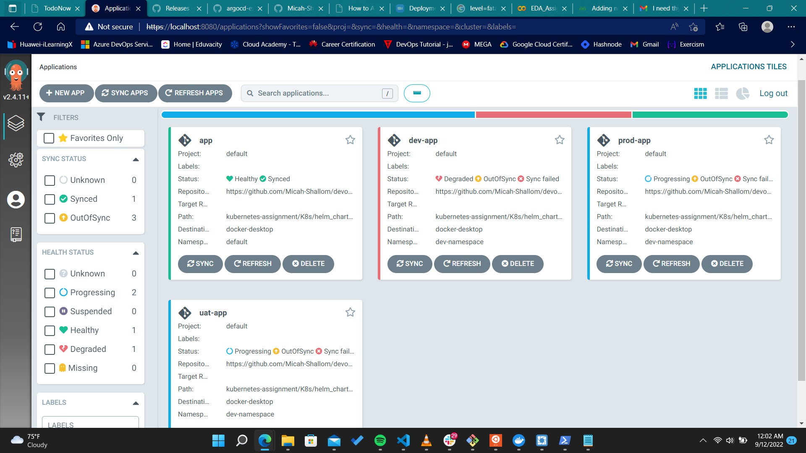

# Deploying application on kubernetes

Source Code : https://github.com/nlharri/simple-todo-app-mongodb-express-node

#
## Find All Deployment Code [Here](./K8s/)
#

Created dockercompose file to test configuration

Fixed database connection for app to connect with 

Application runs well on basic docker containers

## Cluster Deployment
#

Wrote helm chart deployment for application

Running application

Creating new namespaces for each stage

All deployed environments

